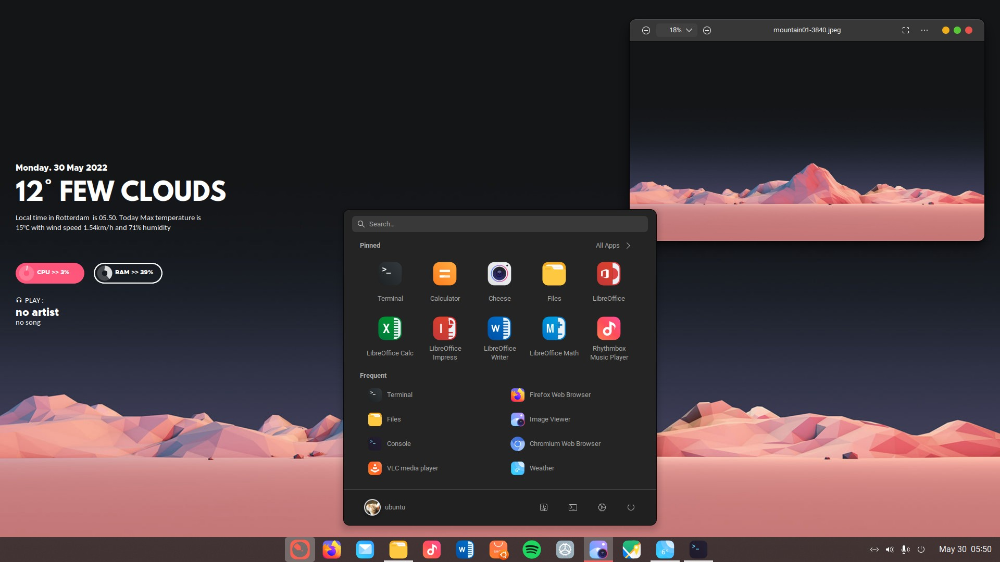

<h1 align="center">
  <b>Customize Ubuntu 22.04 LTS</b>
</h1>

  

## **Initial Setup**

- **Update ubuntu system - `sudo apt update && sudo apt upgrade -y`**

- **Install GNOME-Tweak - `sudo apt install gnome-tweaks`**

Download Resource
Download resource : https://www.pling.com/p/1805660/

Install GTK Theme
Download https://github.com/vinceliuice/WhiteSur-gtk-theme
./install.sh -t redInstall Icon Theme

Download https://github.com/yeyushengfan258/Reversal-icon-theme
./install.sh -red

Install Fonts
Download and Extract font to ~./local/share/fonts

Install Cursors
Download https://github.com/vinceliuice/Vimix-cursors

Download and Extract, enter to directory Vimix-cursors:
./install.sh

Create folder ~./icons. move folder ~./local/share/icons/Vimic-cursors to ~./icons

Install GNOME Extensions
Restore our GNOME Extensions backup
Extract extensions.zip then copy/move all gnome extensions inside folder extensions to
~/.local/share/gnome-shell/extensions

Install from extension.gnome.org
•User Themes : https://extensions.gnome.org/extension/19/user-themes/
•ArcMenu : https://extensions.gnome.org/extension/3628/arcmenu/
•Blur my Shell : https://extensions.gnome.org/extension/3193/blur-my-shell/
•Dash to Panel : https://extensions.gnome.org/extension/1160/dash-to-panel/
•GSConnect : https://extensions.gnome.org/extension/1319/gsconnect/
•media-controls : https://github.com/programmer-pony/media-controls
•Coverflow Alt-Tab : https://extensions.gnome.org/extension/97/coverflow-alt-tab/
•Restore dconf - dconf load /org/gnome/shell/extensions/ < ~/<backupfile>

  Apply Themes, Icons, Fonts, Cursors
Open GNOME Tweaks Tools

  Change Themes, Icons, Fonts, Cursors
Theme : Vimix-white-cursors
Icons : Reversal-red-dark
Shell : Whitesur-dark-solid-redLegacy Applications : Whitesur-dark-solid-red

  Fonts
Interface text : roboto regular
